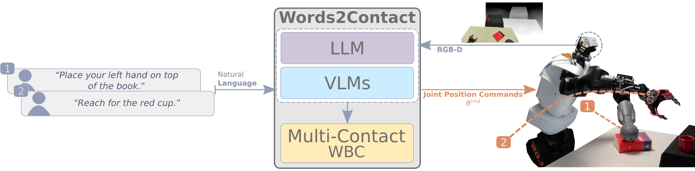

# Words2Contact: Identifying Support Contacts from Verbal Instructions Using Foundation Models



Official implementation of the paper "Words2Contact: Identifying Support Contacts from Verbal Instructions Using Foundation Models" presented at IEEE-RAS Humanoids 2024.

This code only contains the implementation of the LLMs/VLMs part, for the multi-contact whole body controller please contact the authors.

For more information, please visit the [paper website](https://hucebot.github.io/words2contact_website/).

```bash
.
├── .ci
│   └── Dockerfile  # Dockerfile for building the docker image
├── data
│   ├── README.md   # Instructions for downloading the dataset
│   └── test.png    # A single image to test the pipeline
├── launch.sh       # Script for launching the docker container
├── models          # Placeholder for the pre-trained models
│   └── README.md   # Instructions for downloading and using local models
├── utils
│   ├── CLIP_Surgery    # External code for CLIP_Surgery (segmentation)
│   └── config          # Configuration file needed for GroundingDINO
│       └── GroundingDINO_SwinT_OGC.py
└── words2contact   # Source code for Words2Contact
    ├── grammar     # Files to constraint the output of the LLMs
    │   ├── classifier.gbnf
    │   ├── eef_grammar.gbnf
    │   ├── grammar_correction.gbnf
    │   ├── grammar_correction.ts
    │   ├── grammar_predictor.gbnf
    │   ├── grammar_predictor.ts
    │   ├── grammar.ts
    │   ├── new_grammar.ts
    │   ├── README.md
    │   ├── rel_or_abs.gbnf
    │   ├── rel_pos_grammar.gbnf
    │   ├── text_object_detector.gbnf
    │   └── text_object_detector.ts
    ├── prompts     # Prompts for each LLM module
    │   └── prompts.json
    └── scripts    # Python scripts for the pipeline
        ├── geom_utils.py   # Geometry utilities, bounding box, points
        ├── .gitignore
        ├── llm_utils.py    # Words2Contact
        ├── math_pars.py    # Parsing mathematical expressions
        ├── openai_key.py   # OpenAI API key (not provided)
        ├── saygment.py     # Language Grounded Segmentation
        ├── test_pipeline.py    # Test pipeline for Words2Contact
        └── yello.py        # Language Grounded Object Detection
```

## Installation
1. Clone the repository:
    ```bash
    git clone
    ```

2. Build the docker image:
    ```bash
    docker build -t words2contact -f .ci/Dockerfile .
    ```
3. Run the docker container:
    ```bash
    bash launch.sh
    ```

## Testing the whole pipeline
1. Download the pre-trained models:
    ```bash
    bash download_models.sh
    ```


## Contact
For any questions, please contact Dionis Totsila [dionis.totsila@inria.fr](mailto:dionis.totsila@inria.fr)

## Citing Words2Contact (preprint)
If you use Words2Contact in your research, please cite our paper:
```bibtex
@INPROCEEDINGS{totsila2024words2contactidentifyingsupportcontacts,
    author={Dionis Totsila and Quentin Rouxel and Jean-Baptiste Mouret and Serena Ivaldi},
    booktitle={2024 IEEE-RAS 23rd International Conference on Humanoid Robots (Humanoids)},
    title={Words2Contact: Identifying Support Contacts from Verbal Instructions Using Foundation Models},
    year={2024},
}
```

## Acknowledgements
This research was supported by the CPER CyberEntreprises, the Creativ’Lab platform of Inria/LORIA, the EU Horizon project euROBIN (GA n.101070596), the France 2030 program through the PEPR O2R projects AS3 and PI3 (ANR-22-EXOD-007, ANR-22-EXOD-004)

<div align="center">
    
</div>
